# リハビリ単位調整Webアプリ

リハビリスタッフの担当患者・単位数を調整するアプリケーション。

リハビリの単位調整については、下記の資料をご覧ください。
<a href="https://github.com/kawase-sachiho/portfolio/blob/main/%E8%A8%AD%E8%A8%88%E6%9B%B8/%E3%83%AA%E3%83%8F%E3%83%93%E3%83%AA%E5%8D%98%E4%BD%8D%E8%AA%BF%E6%95%B4%E3%82%A2%E3%83%97%E3%83%AA%E3%81%AE%E8%AA%AC%E6%98%8E.pdf">リハビリの単位調整について</a>

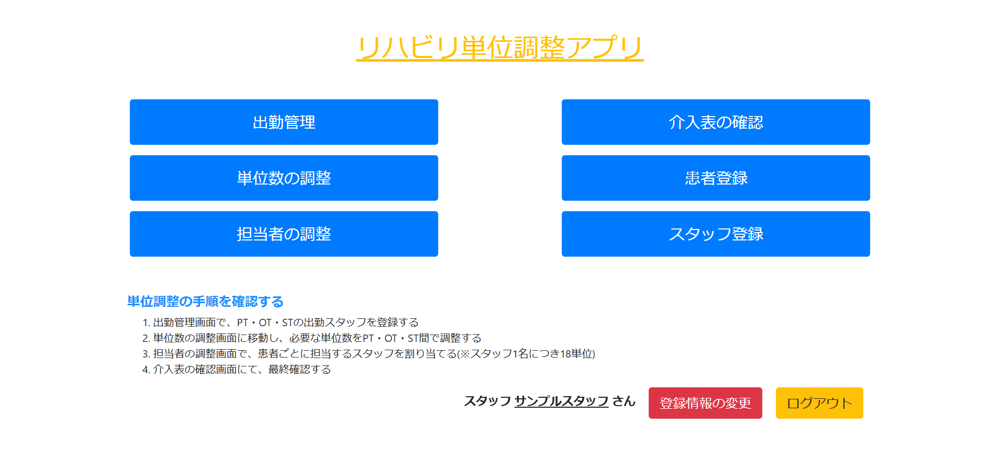
TOP画面。【単位調整の手順を確認する】をクリックするとスライドする形で手順が表示される。

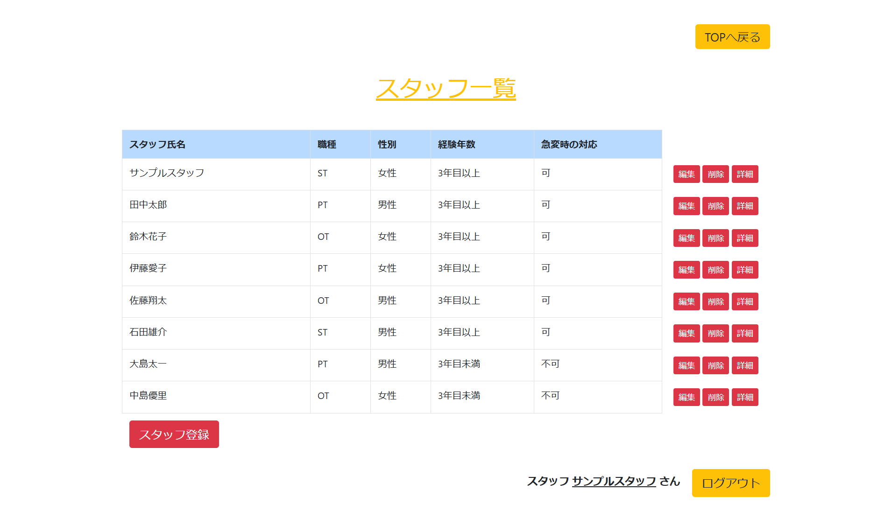
スタッフ一覧画面。職種・性別・経験年数・(患者の)急変時の対応の可否を表示。

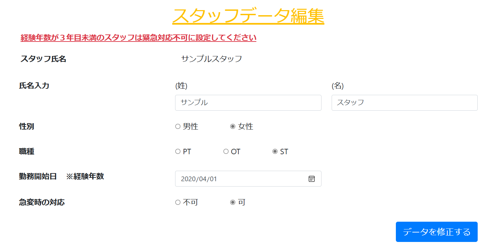
スタッフ情報編集画面。3年目未満のスタッフを急変時の対応可能で登録しようとするとエラーになる。

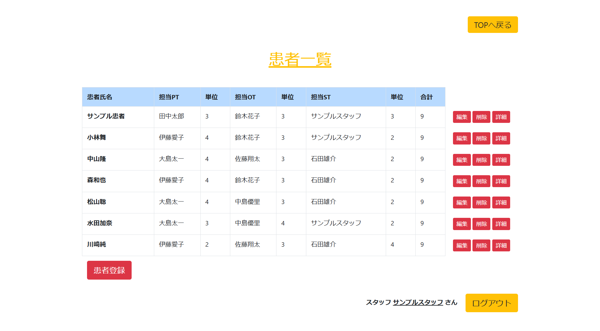
患者情報画面。担当スタッフの氏名と単位数を表示。1人につき最大9単位。

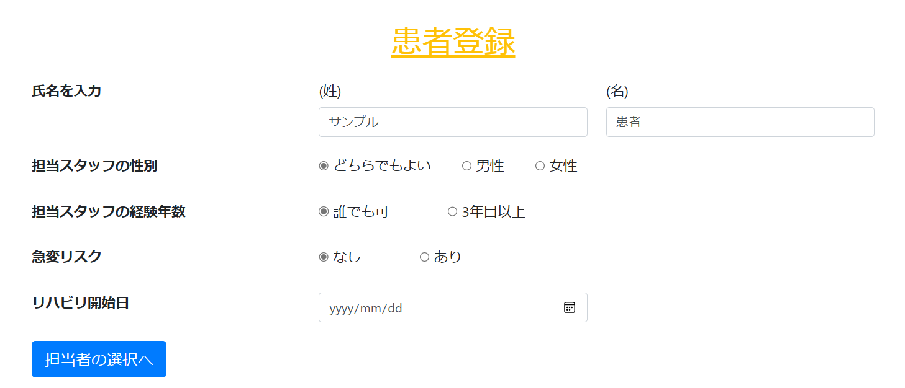
患者登録の、基本情報入力画面。担当するスタッフの性別、経験年数、急変リスクの有無、リハビリ開始日を登録できる。

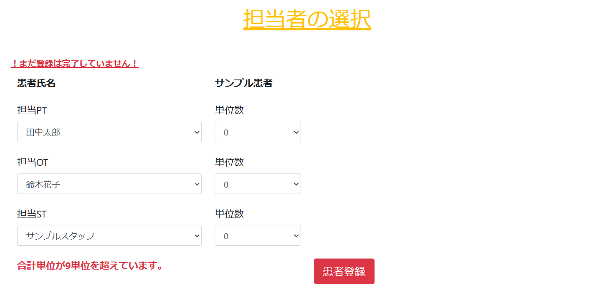
患者登録の、担当者選択画面。PT/OT/STの職種ごとの担当スタッフと単位数を選択。セレクトボックスには、基本情報画面で入力した条件に合致するスタッフしか表示されない。

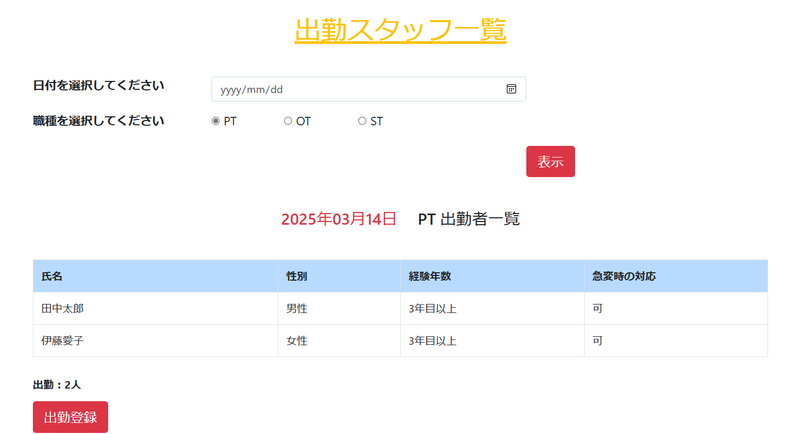
出勤者一覧画面。選択した日付・職種の出勤者一覧を表示する。

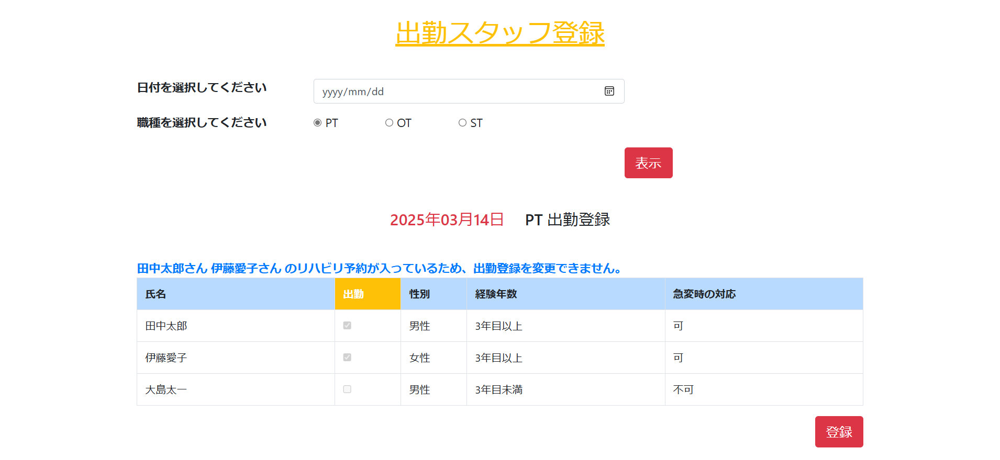
出勤者登録画面。チェックボックス形式で出勤・欠勤を管理する。担当者の調整が行われている場合は、予定を削除しないと変更出来ないようになっている。

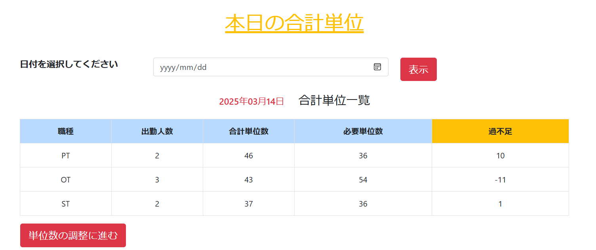
単位一覧画面。各職種ごとに該当日の必要単位数・過不足を表示する。

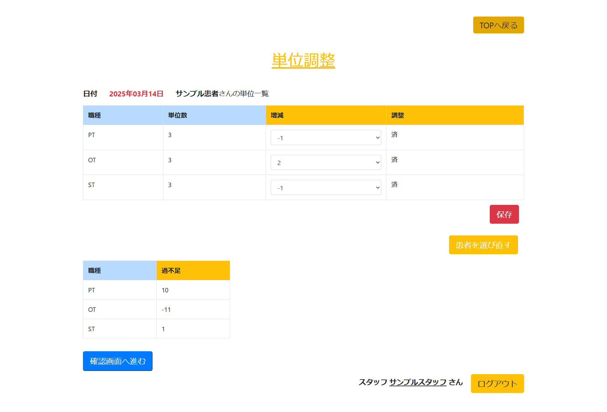
単位調整画面。患者を1名ずつ選択すると、基本の単位数が表示される。下の単位の過不足を参考にしながら単位の調整を行う。既に単位数を調整している患者には「済」と表示される。

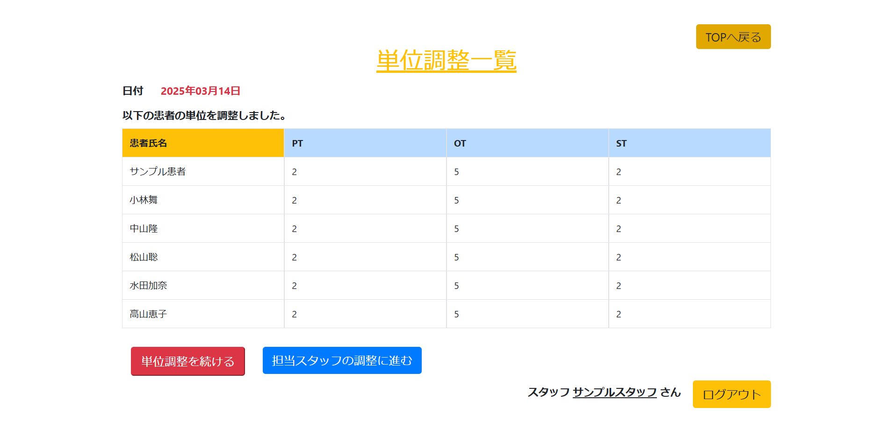
単位調整一覧画面。単位数を調整した患者の一覧を表示。

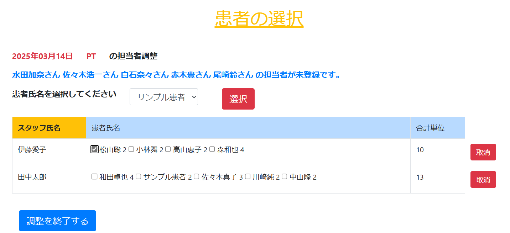
担当者調整の一覧画面。1名ずつ患者を選んで、当日担当するスタッフを選択していく。スタッフが選択されていない患者がいないまま「終了する」をクリックすると、終了していない患者の氏名が表示される。また、チェックボックスで予定を削除することができる。

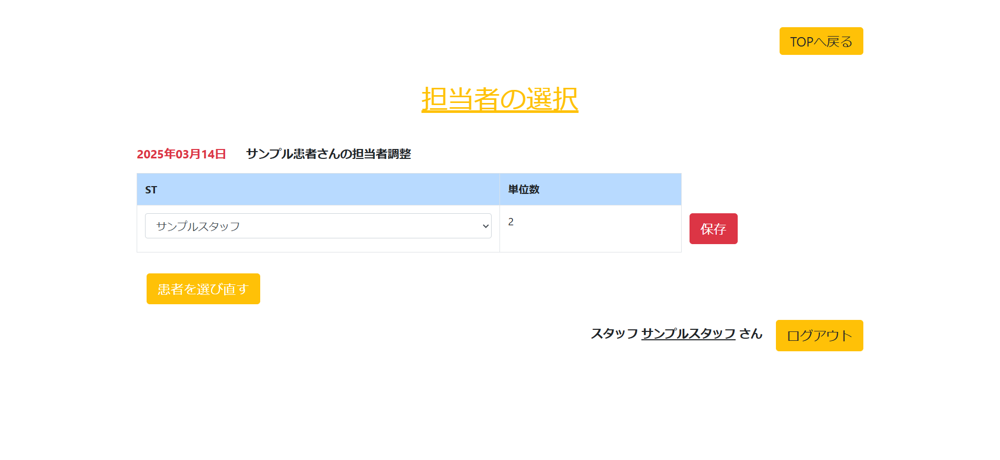
担当者調整のスタッフ選択画面。担当スタッフが出勤していれば、初期値は担当スタッフになる。患者の基本情報の条件に合致した出勤スタッフが選択できる。

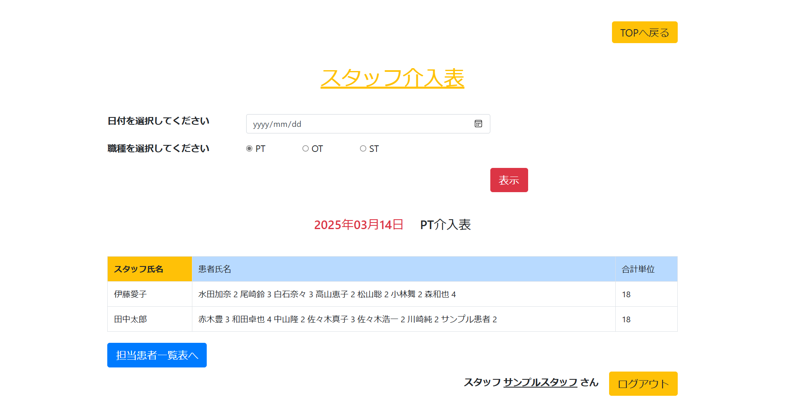
指定した日のスタッフの介入表。

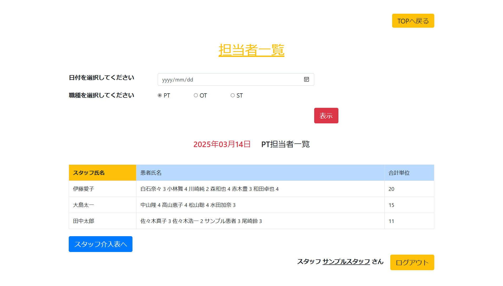
スタッフの担当している患者の一覧表。

## 概要

  - 入院中にリハビリテーションが必要とされる患者に対し、日ごとに担当リハビリスタッフ、単位数(治療時間)を調整する。
  - 出勤人数や患者の病状によって、毎日担当スタッフ・単位数を調整する必要があり、作業時間やミスの軽減の為に作成。
  - 出勤人数を管理し、必要な単位数に応じて単位を増減し、病状に合わせた適切なスタッフを抽出・選択する。

## 開発した背景

私は過去に、総合病院にてリハビリスタッフとして勤務しておりました。
単位調整は毎日行う作業ですが、表計算ソフトを用いて行っていました。
PT(理学療法士)、OT(作業療法士)、ST(言語聴覚士)ごとにファイルを分ける必要があり、ミスが生じたり、時間がかかってしまうケースが多々ありました。
単位調整に時間をかけても、患者様の治療には繋がりません。
効率化が必要だと考え、作成に至りました。

## 使用技術

  - PHP 8.0.15
  - MySQL 10.4.22
  - JavaScript 
  - jQuery 3.7.1

## 機能一覧

  - ユーザー登録、ログイン機能
    - ユーザー情報編集機能
  - 出勤管理機能
    - 出勤者一覧表示機能
    - 出勤登録・修正機能
  - 単位数調整機能
    - 必要な単位数を計算する機能
    - 単位を増減する機能
  - 担当スタッフ調整機能
    - 担当できるスタッフを抽出する機能
    - 担当するスタッフを選択・修正する機能
  - 担当者一覧表確認機能
    - 指定した日の担当スタッフ一覧を表示する機能
    - 基本の担当スタッフ一覧を表示する機能
  - 患者管理機能
    - 患者一覧表示機能
    - 患者登録、削除、修正機能
    - 患者情報確認機能
  - スタッフ管理機能
    - スタッフ一覧表示機能
    - スタッフ登録、削除、修正機能
    - スタッフ情報確認機能

## 苦労した点

  - 出勤登録の修正を行う際、チェックボックスの表示を変更や、データの更新するにあたってのコードの書き方
  - 患者の条件に応じてスタッフを抽出し、セレクトボックスに表示させる機能の実現
  - スタッフが担当している患者の一覧を表示するためのSQL文の作成
